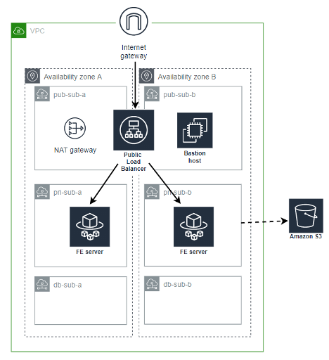

# terraform-demo
Create the following using terraform code:
Resources all on Tokyo region:
    1 VPC
    1 internet gateway associated to the VPC
    1 NAT gateway, in the public subnet
    2 public subnets (default route to internet gateway)
    2 private subnet (default route to NAT gateway)
    2 DB subnet (only local, no default route)
    1 EC2 bastion on public subnet (ssh accessible to your IP only)
    1 application load balancer, (associated to 2 public subnets)
    1 Auto Scaling EC2 instance (use Ubuntu 20.04 AMI)
    1 IAM Role with S3ReadOnly permissions

